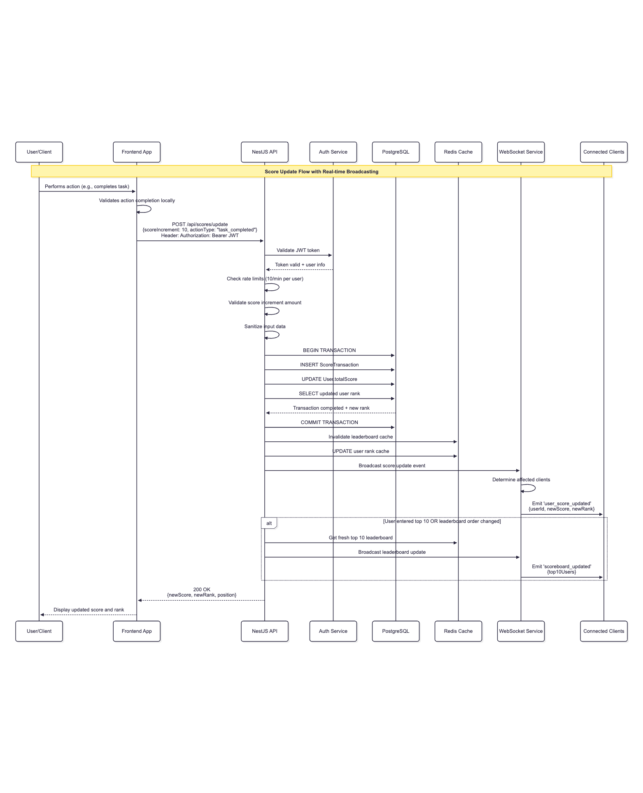
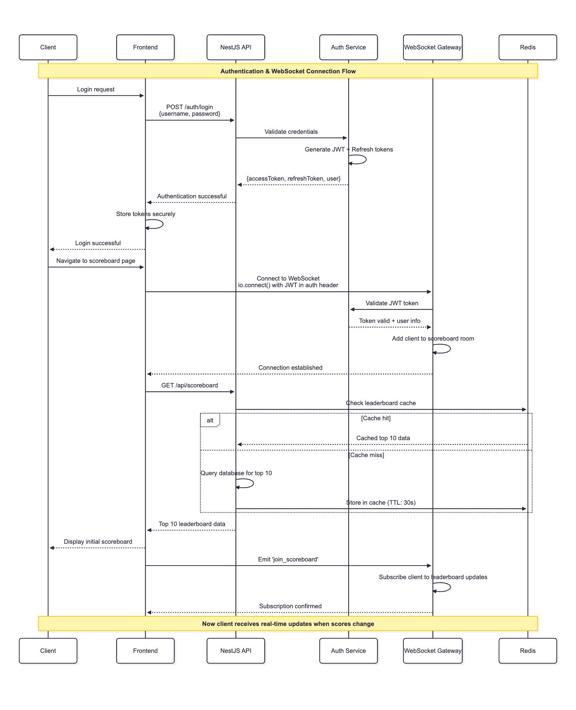
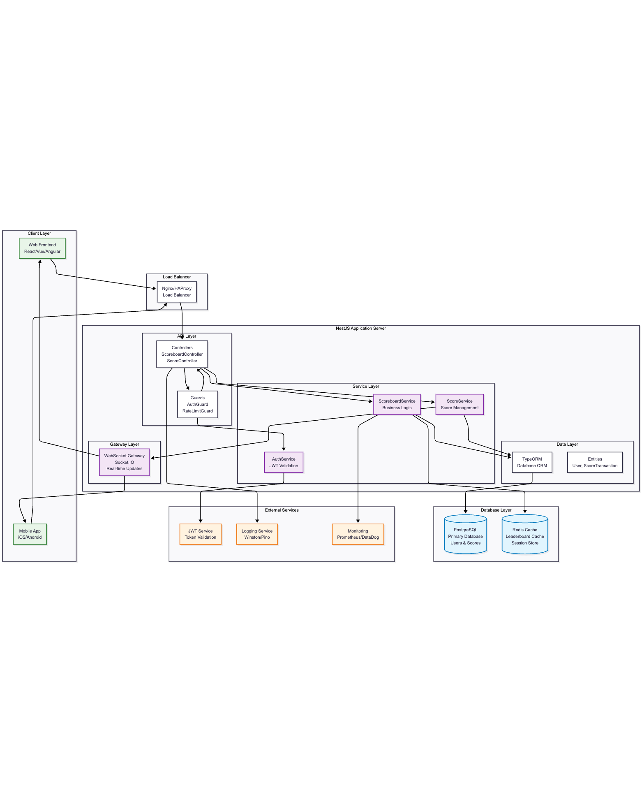
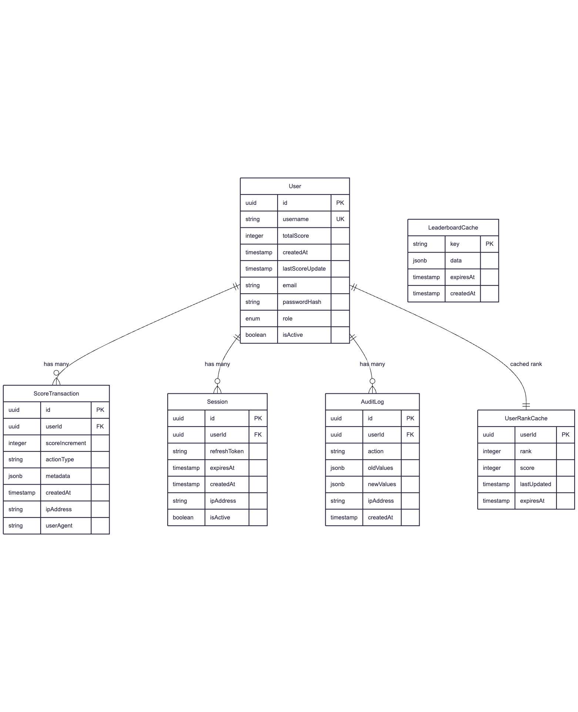

# Live Scoreboard Module - Software Requirements Specification

## 1. Overview and Scope of Work

This document specifies the requirements for a real-time scoreboard module to be implemented as a NestJS backend service. The scoreboard module will:

- Manage user scores and rankings
- Provide real-time scoreboard updates
- Implement secure score validation and authorization
- Expose RESTful APIs and WebSocket connections
- Maintain top 10 user leaderboard

## 2. Functional Requirements

### 2.1 User Score Management (FR-001)

- **Description**: System manage user scores and maintain accurate rankings
- **Acceptance Criteria**:
  - Store user scores with timestamps
  - Calculate and maintain user rankings
  - Support score increments only (no decrements for security)
  - Handle concurrent score updates safely

### 2.2 Real-time Scoreboard Updates (FR-002)

- **Description**: System provide live updates to scoreboard viewers
- **Acceptance Criteria**:
  - Broadcast score changes to all connected clients
  - Maintain WebSocket connections for real-time updates
  - Update top 10 leaderboard in real-time
  - Handle client disconnections gracefully

### 2.3 Secure Score Validation (FR-003)

- **Description**: System prevent unauthorized score manipulation
- **Acceptance Criteria**:
  - Validate user authentication on score updates
  - Implement rate limiting to prevent spam
  - Validate score increment amounts
  - Log all score update attempts for auditing

### 2.4 Leaderboard Management (FR-004)

- **Description**: System maintain and serve top 10 user rankings
- **Acceptance Criteria**:
  - Return top 10 users by score
  - Include user ID, username, score, and rank
  - Sort by score in descending order
  - Handle ties in scoring appropriately

## 3. Non-Functional Requirements

### 3.1 Performance

- **Response Time**: API response within 200ms under normal load
- **Throughput**: Support minimum 1000 concurrent WebSocket connections
- **Scalability**: Horizontally scalable architecture design

### 3.2 Security

- **Authentication**: JWT-based user authentication required
- **Authorization**: Role-based access control for admin functions
- **Rate Limiting**: Maximum 10 score updates per user per minute
- **Input Validation**: All inputs must be sanitized and validated

## 4. System Architecture

### 4.1 Technology Stack

- **Framework**: NestJS
- **Database**: PostgreSQL + TypeORM (why Postgres over NoSQL? because of the ACID compliance and the ability to use transactions)
- **Real-time**: Socket.IO (for real-time updates)
- **Caching**: Redis (for leaderboard caching)
- **Monitoring**: Prometheus & Sentry (for API response time monitoring and error rate tracking)

### 4.2 Module Structure

```
scoreboard/
├── controllers/
│   ├── scoreboard.controller.ts
│   └── score.controller.ts
├── services/
│   ├── scoreboard.service.ts
│   ├── score.service.ts
│   └── websocket.service.ts
├── entities/
│   ├── user.entity.ts
│   └── score.entity.ts
├── dto/
│   ├── update-score.dto.ts
│   └── scoreboard.dto.ts
├── guards/
│   ├── auth.guard.ts
│   └── rate-limit.guard.ts
└── gateways/
    └── scoreboard.gateway.ts
```

## 5. Diagrams

Note: written in Mermaid format and stored in `./diagrams` folder for further editing.

### 5.1 Primary Score Update

- User action → API request → Authentication → Database transaction → Cache update → WebSocket broadcast



### 5.2 Authentication & WebSocket Connection

- Illustrates user authentication and real-time connection establishment
- Login → JWT generation → WebSocket connection → Real-time subscription



### 5.3 System Architecture

- High-level view of all system components and their relationships



### 5.4 Database Schema

- Database structure with entities, relationships, and caching strategy
- **Key Entities**: User, ScoreTransaction, Session, AuditLog, Cache tables




## 6. Security Note

### 6.1 Authentication & Authorization

- JWT tokens with 1-hour expiration
- Refresh token mechanism for session management
- Role-based permissions (user, admin)

### 6.2 Score Validation

- Server-side validation of all score increments
- Maximum score increment limits per action type
- Audit trail of all score changes
- Anomaly detection for suspicious patterns

### 6.3 Rate Limiting

- Per-user rate limits on score updates
- IP-based rate limiting for anonymous requests
- Progressive penalties for limit violations

### 6.4 Input Sanitization

- Validate all input parameters
- Prevent SQL injection and XSS attacks
- Sanitize metadata fields

## 7. Implementation Note

### 7.1 Caching Strategy

- Redis cache for top 10 leaderboard (TTL: 30 seconds)
- Cache invalidation on score updates
- User rank caching with smart invalidation

### 7.2 Real-time Updates

- Socket.IO rooms for efficient broadcasting
- Connection management and cleanup
- Heartbeat mechanism for connection monitoring

### 7.3 Error Handling

- Structured error responses with error codes
- Comprehensive logging for debugging
- Graceful degradation when external services fail

## 8. Testing note

### 8.1 Integration Tests

- API endpoint testing
- WebSocket connection testing
- Database transaction testing

### 8.2 Performance Tests

- Load testing for concurrent users
- WebSocket connection limits
- Database query performance

## 9. Deployment Note

### 9.1 Environment Configuration

- Database connection
- Redis config
- JWT secret
- Rate limiting 

### 9.2 Monitoring tools

- API response time monitoring (Prometheus)
- WebSocket connection metrics (Prometheus)
- Error rate tracking (Prometheus)
- Security incident alerting (Sentry)
