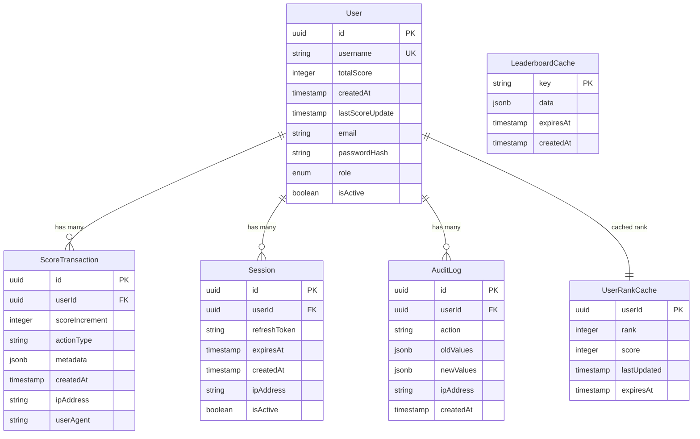

```mermaid
erDiagram
    User {
        uuid id PK
        string username UK
        integer totalScore
        timestamp createdAt
        timestamp lastScoreUpdate
        string email
        string passwordHash
        enum role
        boolean isActive
    }

    ScoreTransaction {
        uuid id PK
        uuid userId FK
        integer scoreIncrement
        string actionType
        jsonb metadata
        timestamp createdAt
        string ipAddress
        string userAgent
    }

    Session {
        uuid id PK
        uuid userId FK
        string refreshToken
        timestamp expiresAt
        timestamp createdAt
        string ipAddress
        boolean isActive
    }

    AuditLog {
        uuid id PK
        uuid userId FK
        string action
        jsonb oldValues
        jsonb newValues
        string ipAddress
        timestamp createdAt
    }

    User ||--o{ ScoreTransaction : "has many"
    User ||--o{ Session : "has many"
    User ||--o{ AuditLog : "has many"

    %% Additional relationships for caching strategy
    LeaderboardCache {
        string key PK
        jsonb data
        timestamp expiresAt
        timestamp createdAt
    }

    UserRankCache {
        uuid userId PK
        integer rank
        integer score
        timestamp lastUpdated
        timestamp expiresAt
    }

    User ||--|| UserRankCache : "cached rank"
```
