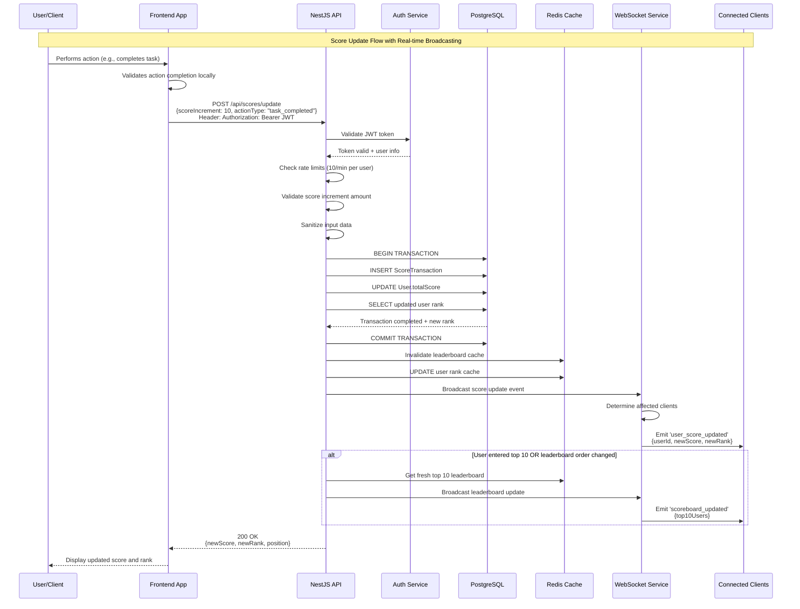
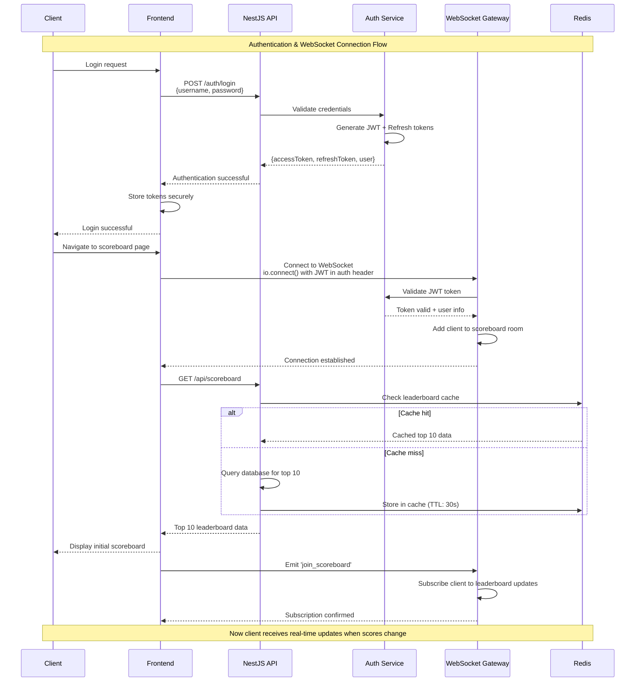

# Score Update Flow

```mermaid
sequenceDiagram
    participant U as User/Client
    participant F as Frontend App
    participant API as NestJS API
    participant Auth as Auth Service
    participant DB as PostgreSQL
    participant Cache as Redis Cache
    participant WS as WebSocket Service
    participant C as Connected Clients

    Note over U,C: Score Update Flow with Real-time Broadcasting

    %% User performs action
    U->>F: Performs action (e.g., completes task)
    F->>F: Validates action completion locally
    
    %% Score update request
    F->>API: POST /api/scores/update<br/>{scoreIncrement: 10, actionType: "task_completed"}<br/>Header: Authorization: Bearer JWT
    
    %% Authentication and validation
    API->>Auth: Validate JWT token
    Auth-->>API: Token valid + user info
    
    API->>API: Check rate limits (10/min per user)
    API->>API: Validate score increment amount
    API->>API: Sanitize input data
    
    %% Database transaction
    API->>DB: BEGIN TRANSACTION
    API->>DB: INSERT ScoreTransaction
    API->>DB: UPDATE User.totalScore
    API->>DB: SELECT updated user rank
    DB-->>API: Transaction completed + new rank
    API->>DB: COMMIT TRANSACTION
    
    %% Cache update
    API->>Cache: Invalidate leaderboard cache
    API->>Cache: UPDATE user rank cache
    
    %% Real-time notification
    API->>WS: Broadcast score update event
    WS->>WS: Determine affected clients
    WS->>C: Emit 'user_score_updated'<br/>{userId, newScore, newRank}
    
    %% Check if leaderboard changed
    alt User entered top 10 OR leaderboard order changed
        API->>Cache: Get fresh top 10 leaderboard
        API->>WS: Broadcast leaderboard update
        WS->>C: Emit 'scoreboard_updated'<br/>{top10Users}
    end
    
    %% Response to original client
    API-->>F: 200 OK<br/>{newScore, newRank, position}
    F-->>U: Display updated score and rank
```

# Authentication & WebSocket Connection Flow

```mermaid

sequenceDiagram
    participant C as Client
    participant F as Frontend
    participant API as NestJS API
    participant Auth as Auth Service
    participant WS as WebSocket Gateway
    participant Cache as Redis

    Note over C,Cache: Authentication & WebSocket Connection Flow

    %% Authentication
    C->>F: Login request
    F->>API: POST /auth/login<br/>{username, password}
    API->>Auth: Validate credentials
    Auth->>Auth: Generate JWT + Refresh tokens
    Auth-->>API: {accessToken, refreshToken, user}
    API-->>F: Authentication successful
    F->>F: Store tokens securely
    F-->>C: Login successful

    %% WebSocket connection for real-time updates
    C->>F: Navigate to scoreboard page
    F->>WS: Connect to WebSocket<br/>io.connect() with JWT in auth header
    WS->>Auth: Validate JWT token
    Auth-->>WS: Token valid + user info
    WS->>WS: Add client to scoreboard room
    WS-->>F: Connection established
    
    %% Initial data load
    F->>API: GET /api/scoreboard
    API->>Cache: Check leaderboard cache
    alt Cache hit
        Cache-->>API: Cached top 10 data
    else Cache miss
        API->>API: Query database for top 10
        API->>Cache: Store in cache (TTL: 30s)
    end
    API-->>F: Top 10 leaderboard data
    F-->>C: Display initial scoreboard

    %% Real-time updates subscription
    F->>WS: Emit 'join_scoreboard'
    WS->>WS: Subscribe client to leaderboard updates
    WS-->>F: Subscription confirmed

    Note over C,Cache: Now client receives real-time updates when scores change
```