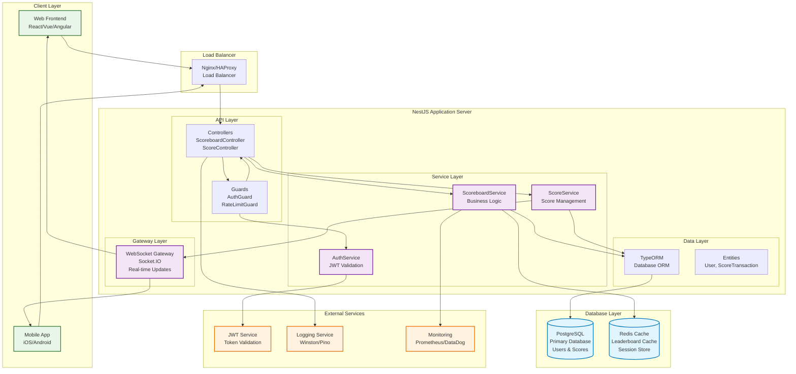

# System Architecture Overview

```mermaid
graph TB
    subgraph "Client Layer"
        UI[Web Frontend<br/>React/Vue/Angular]
        Mobile[Mobile App<br/>iOS/Android]
    end

    subgraph "Load Balancer"
        LB[Nginx/HAProxy<br/>Load Balancer]
    end

    subgraph "NestJS Application Server"
        subgraph "API Layer"
            Controller[Controllers<br/>ScoreboardController<br/>ScoreController]
            Guards[Guards<br/>AuthGuard<br/>RateLimitGuard]
        end

        subgraph "Service Layer"
            ScoreboardService[ScoreboardService<br/>Business Logic]
            ScoreService[ScoreService<br/>Score Management]
            AuthService[AuthService<br/>JWT Validation]
        end

        subgraph "Gateway Layer"
            WSGateway[WebSocket Gateway<br/>Socket.IO<br/>Real-time Updates]
        end

        subgraph "Data Layer"
            TypeORM[TypeORM<br/>Database ORM]
            Entities[Entities<br/>User, ScoreTransaction]
        end
    end

    subgraph "Database Layer"
        PostgreSQL[(PostgreSQL<br/>Primary Database<br/>Users & Scores)]
        Redis[(Redis Cache<br/>Leaderboard Cache<br/>Session Store)]
    end

    subgraph "External Services"
        JWT[JWT Service<br/>Token Validation]
        Logger[Logging Service<br/>Winston/Pino]
        Monitor[Monitoring<br/>Prometheus/DataDog]
    end

    %% Connections
    UI --> LB
    Mobile --> LB
    LB --> Controller
    Controller --> Guards
    Guards --> Controller
    Controller --> ScoreboardService
    Controller --> ScoreService
    ScoreboardService --> TypeORM
    ScoreService --> TypeORM
    ScoreService --> WSGateway
    TypeORM --> PostgreSQL
    ScoreboardService --> Redis
    WSGateway --> UI
    WSGateway --> Mobile
    Guards --> AuthService
    AuthService --> JWT
    Controller --> Logger
    ScoreboardService --> Monitor

    %% Styling
    classDef database fill:#e1f5fe,stroke:#0277bd,stroke-width:2px
    classDef service fill:#f3e5f5,stroke:#7b1fa2,stroke-width:2px
    classDef external fill:#fff3e0,stroke:#ef6c00,stroke-width:2px
    classDef client fill:#e8f5e8,stroke:#2e7d32,stroke-width:2px

    class PostgreSQL,Redis database
    class ScoreboardService,ScoreService,AuthService,WSGateway service
    class JWT,Logger,Monitor external
    class UI,Mobile client

```
